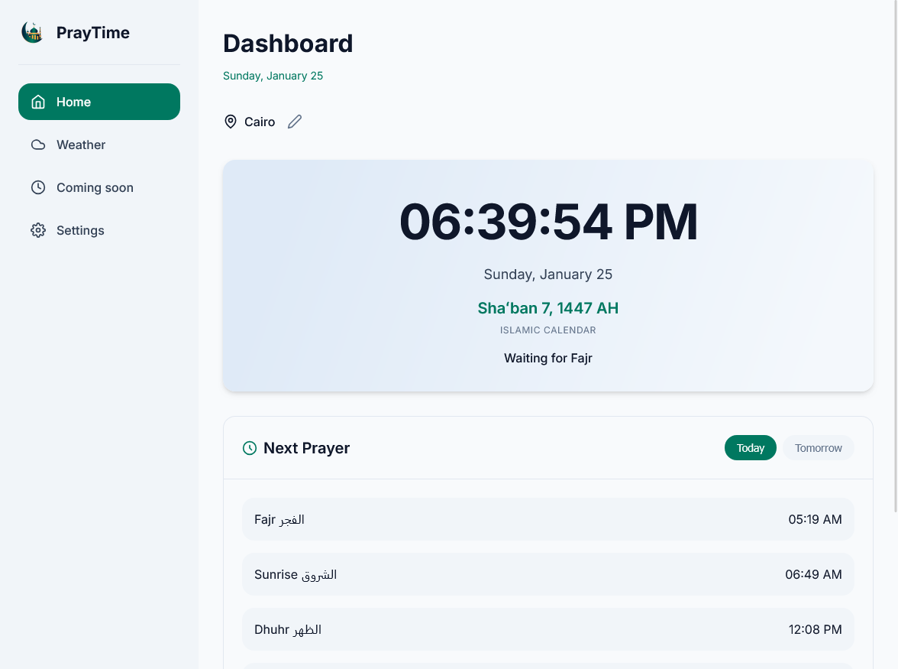
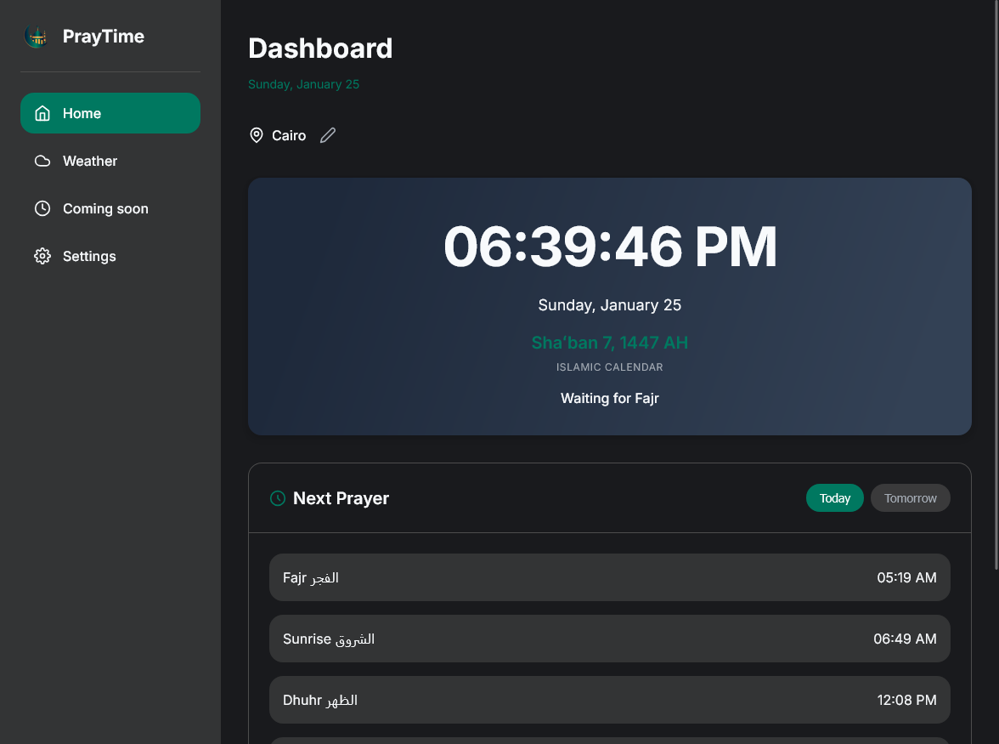

  

  # PrayTime

  **A modern, accurate, and privacy-focused Islamic Prayer Times & Weather Dashboard.**
  
  

    <a href="#features">Features</a> •
    <a href="#tech-stack">Tech Stack</a> •
    <a href="#credits">Credits</a> •
    <a href="./version.md">Changelog</a>
  

  
    
  

---

## 📖 About

**PrayTime** is a lightweight web application designed to help Muslims track prayer times accurately while staying updated with the weather. It features a beautiful, modern interface with glassmorphism effects, dark mode support, and automatic location detection.

Unlike other apps, PrayTime respects your privacy by running entirely in your browser without tracking your data.

 

## ✨ Features

- 🕌 **Accurate Prayer Times:** Calculates times for Fajr, Dhuhr, Asr, Maghrib, and Isha based on your location.
- 📍 **Smart Location:** Auto-detects your location via GPS or allows manual search with auto-suggestions.
- 🌤 **Weather Forecast:** Real-time weather updates, hourly forecasts, and 7-day predictions.
- 🍃 **Air Quality Index:** Live AQI data to help you plan your outdoor activities.
- 🎨 **Modern UI:** Responsive design with smooth animations and a beautiful "Glassmorphism" look.
- 🌙 **Theme Support:** Fully functional Light and Dark modes (syncs with system settings).
- ⚙️ **Customizable:** Set a default location in settings that persists across the entire app.

 

## 🛠 Tech Stack

- **Frontend:** HTML5, CSS3 (Modern Variables & Flexbox/Grid), JavaScript (ES6+).
- **APIs:**
  - `Adhan.js` (Prayer Calculation)
  - `Open-Meteo` (Weather & Air Quality)
  - `OpenStreetMap / Nominatim` (Geocoding & City Search)
- **Libraries:** Chart.js (for Weather graphs).

 

## ❤️ Credits

This project was built and designed by **MMS**.

- **Developer:** [MMS](https://github.com/mmssb)
- **Libraries Used:**
  - `Adhan.js` (Prayer Times Calculation)
  - `Chart.js` (Weather Graphs)
  - `Open-Meteo` (Weather API)
- **Icons:** Weather Icons / Lucide / FontAwesome
- **License:** MIT License

---

   
  
    
  
<b>Made with ❤️ by MMS</b>

  
© 2024 PrayTime. All Rights Reserved.

